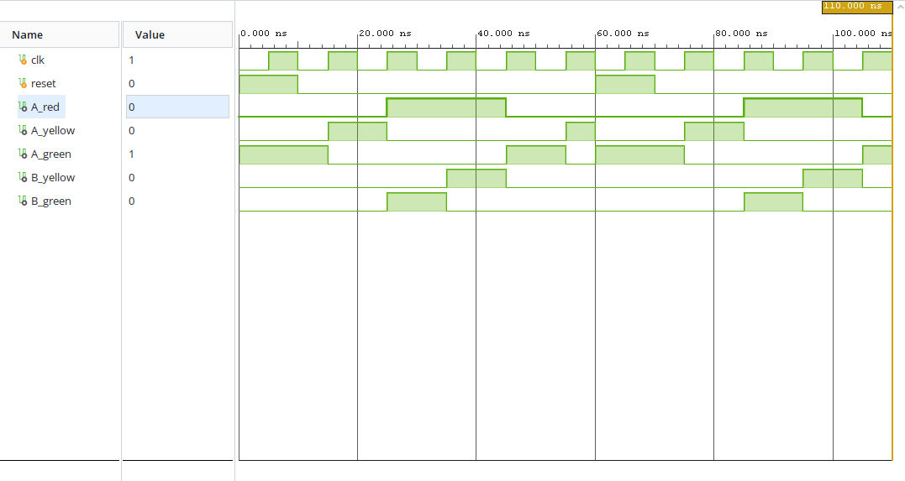

# Traffic Light Controller Using Verilog HDL

## Project Overview

This project implements a two-road traffic light controller using
Verilog HDL and a Finite State Machine (FSM) architecture.

The controller manages the traffic signals for two roads and ensures
that the signals transition through predefined states in a safe and
controlled sequence.

## FSM State Sequence

The controller operates through four states:

S0 → S1 → S2 → S3 → S0

| State | Road A | Road B |
|-------|--------|--------|
| S0 | Green | Red |
| S1 | Yellow | Red |
| S2 | Red | Green |
| S3 | Red | Yellow |

## Design Features

- FSM-based RTL design
- Two-road traffic control
- Synchronous state transitions
- Asynchronous reset
- Six traffic light outputs
- Verilog HDL implementation
- Functional simulation and verification

## Inputs

- `clk` - System clock
- `reset` - Asynchronous reset

## Outputs

### Road A
- `A_red`
- `A_yellow`
- `A_green`

### Road B
- `B_red`
- `B_yellow`
- `B_green`

## Design Flow

RTL Design → Testbench → Functional Simulation → Waveform Verification

## Tools Used

- Verilog HDL
- Xilinx Vivado
- RTL Simulation
- GitHub

## Simulation Results

The design was simulated using Xilinx Vivado.

The waveform confirms the correct FSM sequence:

S0 → S1 → S2 → S3 → S0



## Verification

The following conditions were verified:

- Road A green / Road B red
- Road A yellow / Road B red
- Road A red / Road B green
- Road A red / Road B yellow
- Correct state transitions
- Reset functionality

## Project Structure

```text
traffic-light-controller-verilog/
│
├── rtl/
│   └── traffic_light_controller.v
│
├── testbench/
│   └── traffic_light_controller_tb.v
│
├── simulation/
│   └── waveform.png
│
└── README.md
